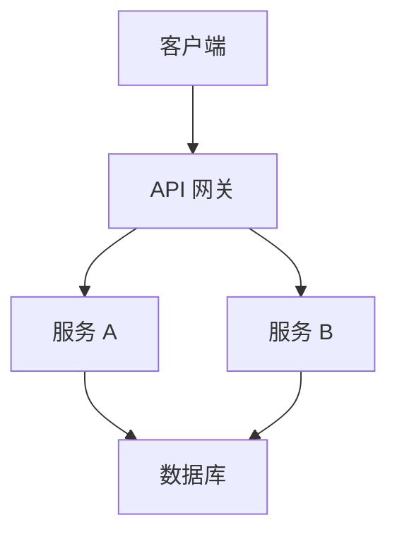
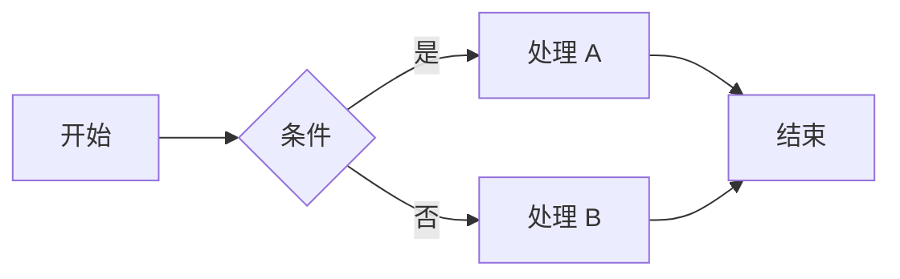
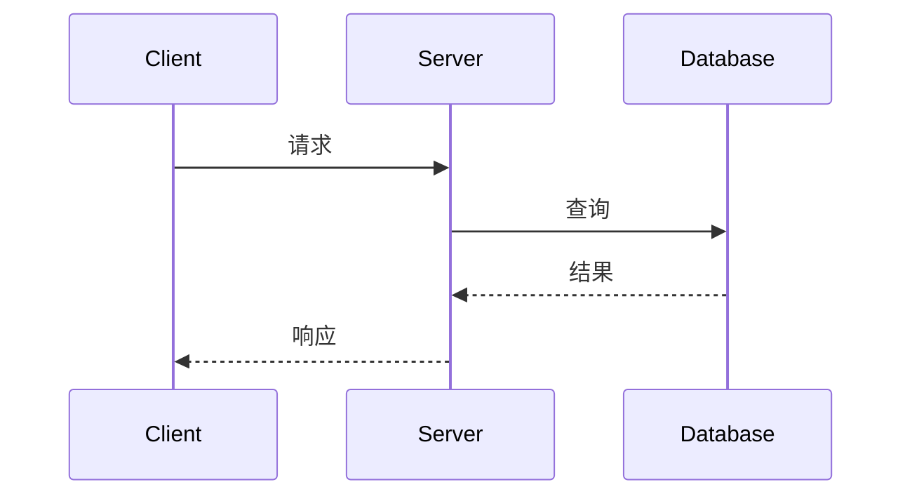

# 文档编写规范

> 定义项目文档的编写标准和维护流程。

---

## 1. 文档类型

### 1.1 技术文档

| 类型 | 用途 | 位置 |
|------|------|------|
| README | 项目概述、快速开始 | 项目根目录 |
| API 文档 | 接口说明 | `docs/api/` |
| 架构文档 | 系统设计 | `docs/architecture/` |
| 部署文档 | 部署指南 | `docs/deployment/` |

### 1.2 协议文档

| 类型 | 用途 | 位置 |
|------|------|------|
| 协议入口 | AI 会话起点 | `.agent/start-here.md` |
| 核心规则 | 不可妥协原则 | `.agent/core/` |
| 项目上下文 | 业务信息 | `.agent/project/` |
| 技能模块 | 可复用能力 | `.agent/skills/` |

---

## 2. Markdown 规范

### 2.1 标题层级

```markdown
# 文档标题（仅一个）

> 文档简介

---

## 一级章节

### 二级章节

#### 三级章节（最深层级）
```

### 2.2 代码块

必须指定语言：

````markdown
```python
def hello():
    print("Hello")
```

```rust
fn hello() {
    println!("Hello");
}
```

```bash
echo "Hello"
```
````

### 2.3 表格

```markdown
| 列1 | 列2 | 列3 |
|-----|-----|-----|
| A   | B   | C   |
| D   | E   | F   |
```

### 2.4 列表

```markdown
无序列表：
- 项目 1
- 项目 2
  - 子项目 2.1
  - 子项目 2.2

有序列表：
1. 步骤 1
2. 步骤 2
3. 步骤 3

任务列表：
- [ ] 待完成
- [x] 已完成
```

---

## 3. README 模板

```markdown
# 项目名称

> 一句话描述项目用途

## 功能特性

- 特性 1
- 特性 2
- 特性 3

## 快速开始

### 安装

```bash
# 安装命令
```

### 配置

```bash
# 配置命令
```

### 运行

```bash
# 运行命令
```

## 文档

- [API 文档](docs/api/)
- [架构设计](docs/architecture/)
- [部署指南](docs/deployment/)

## 贡献指南

详见 [CONTRIBUTING.md](CONTRIBUTING.md)

## 许可证

[LICENSE](LICENSE)
```

---

## 4. API 文档模板

```markdown
# API 名称

## 概述

[API 用途描述]

## 端点

### POST /api/resource

创建资源

**请求**

```json
{
  "name": "string",
  "type": "string"
}
```

**响应**

```json
{
  "id": 1,
  "name": "string",
  "type": "string",
  "created_at": "2026-01-23T10:00:00Z"
}
```

**错误码**

| 状态码 | 说明 |
|--------|------|
| 400 | 请求参数错误 |
| 401 | 未授权 |
| 500 | 服务器错误 |

**示例**

```bash
curl -X POST https://api.example.com/api/resource \
  -H "Content-Type: application/json" \
  -d '{"name": "test", "type": "demo"}'
```
```

---

## 5. ADR 模板

```markdown
# ADR-XXX: 决策标题

## 状态

草案 | 已批准 | 已废弃 | 已取代

## 日期

YYYY-MM-DD

## 背景

[描述导致此决策的背景和问题]

## 决策

[描述做出的决策及原因]

## 后果

[描述此决策的影响，包括正面和负面]

## 备选方案

[列出考虑过但未采用的方案]
```

---

## 6. 文档维护规则

### 6.1 同步更新

| 代码变更 | 文档更新 |
|----------|----------|
| 新增 API | 更新 API 文档 |
| 修改配置项 | 更新配置说明 |
| 修复 Bug | 更新 bug-prevention.md |
| 架构变更 | 创建/更新 ADR |

### 6.2 版本标记

每个文档应包含：

```markdown
---
*最后更新: YYYY-MM-DD*
*版本: X.X.X*
```

### 6.3 审查周期

| 文档类型 | 审查周期 |
|----------|----------|
| README | 每次发布 |
| API 文档 | 每次 API 变更 |
| 架构文档 | 每季度 |
| 协议文档 | 每月 |

---

## 7. 图表规范

### 7.1 架构图

使用 Mermaid 或 PlantUML：



### 7.2 流程图



### 7.3 时序图



---

## 8. 检查清单

### 新文档

- [ ] 使用正确的模板
- [ ] 标题层级正确
- [ ] 代码块有语言标签
- [ ] 链接可用
- [ ] 版本和日期已标记

### 更新文档

- [ ] 内容与代码同步
- [ ] 更新日期已修改
- [ ] 版本号已更新（如适用）
- [ ] 相关文档已联动更新

---

*此文件为通用引擎规则，禁止包含任何项目特定信息*
*协议版本: 2.1.0*
